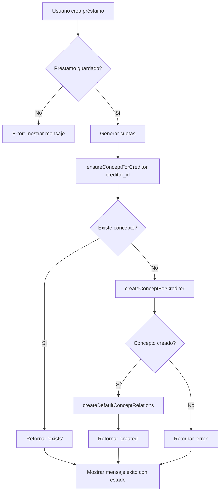

# 🆕 Feature: Creación Automática de Conceptos para Préstamos

**Fecha**: 26 de Diciembre, 2025
**Versión**: 3.5.14
**Tipo**: Feature - Automatización Creación Conceptos
**Fórmula**: `CUOTAPRESTAMO(FICHA, creditor_id)`

---

## 📋 **Descripción**

Implementación de creación automática de conceptos de deducción cuando se registran préstamos en el sistema. Esta funcionalidad garantiza que cada acreedor tenga su concepto de deducción correspondiente en las planillas, sin necesidad de crearlos manualmente.

**Fórmula Utilizada**: `CUOTAPRESTAMO(FICHA, '{creditor_id}')`
- **FICHA**: Variable del empleado
- **creditor_id**: Código del acreedor (varchar, ej: "PER001", "VEH002")

---

## 🎯 **Objetivo**

Cuando se crea un préstamo para un acreedor específico, el sistema:

1. **Verifica** si existe un concepto de deducción para ese acreedor
2. **Crea automáticamente** el concepto si no existe
3. **Reutiliza** el concepto existente si ya fue creado previamente
4. **Informa** al usuario sobre el resultado de la operación

---

## 🔧 **Cambios Implementados**

### **Archivo Modificado**: `app/Controllers/LoanController.php`

#### **1. Nuevas Propiedades de Clase** (Línea 21)
```php
private $conceptModel;
```

#### **2. Constructor Actualizado** (Líneas 23-32)
```php
public function __construct()
{
    parent::__construct();
    $this->requireAuth();
    $this->loanModel = new Loan();
    $this->installmentModel = new LoanInstallment();
    $this->employeeModel = new Employee();
    $this->creditorModel = new Creditor();
    $this->conceptModel = new \App\Models\Concept(); // ← NUEVO
}
```

#### **3. Import Agregado** (Línea 14)
```php
use PDO;
```

#### **4. Método `store()` Mejorado** (Líneas 136-148)

**ANTES**:
```php
$_SESSION['success'] = 'Préstamo creado y cuotas generadas correctamente.';
$this->redirect(\App\Core\UrlHelper::route('panel/loans'));
```

**DESPUÉS**:
```php
// Verificar y crear concepto automáticamente para el acreedor
$conceptResult = $this->ensureConceptForCreditor($data['creditor_id']);

$successMessage = 'Préstamo creado y cuotas generadas correctamente.';
if ($conceptResult === 'created') {
    $successMessage .= ' Concepto de deducción creado automáticamente.';
} elseif ($conceptResult === 'exists') {
    $successMessage .= ' Concepto de deducción ya existente.';
} elseif ($conceptResult === 'error') {
    $successMessage .= ' (Advertencia: no se pudo verificar/crear el concepto)';
}

$_SESSION['success'] = $successMessage;
$this->redirect(\App\Core\UrlHelper::route('panel/loans'));
```

#### **5. Nuevos Métodos Privados** (Líneas 341-527)

##### **a) `ensureConceptForCreditor($creditorId)` - Método Coordinador**
- **Propósito**: Verificar existencia de concepto y crear si es necesario
- **Retorna**: `'created'`, `'exists'`, o `'error'`
- **Flujo**:
  1. Obtiene información del acreedor
  2. Busca concepto existente para ese acreedor
  3. Crea concepto si no existe
  4. Retorna estado de la operación

##### **b) `findConceptByCreditorId($creditorId)` - Búsqueda de Concepto**
- **Propósito**: Buscar concepto que use la fórmula `CUOTAPRESTAMO(FICHA, '{creditor_id}')`
- **Proceso**:
  1. Obtiene el código del acreedor (`creditor_id` varchar)
  2. Busca concepto por fórmula con ese código
- **Query SQL**:
```sql
SELECT * FROM concepto
WHERE (formula LIKE '%CUOTAPRESTAMO(FICHA, \'PER001\')%'
       OR formula LIKE '%CUOTAPRESTAMO(FICHA, 5)%')
AND activo = 1
LIMIT 1
```
- **Nota**: Busca por código string (creditor_id) o ID numérico para compatibilidad

##### **c) `createConceptForCreditor($creditorId, $creditorDescription)` - Creación de Concepto**
- **Propósito**: Crear concepto de deducción para el acreedor usando fórmula CUOTAPRESTAMO
- **Proceso**:
  1. Obtiene el código del acreedor (`creditor_id` varchar, ej: "PER001")
  2. Genera código único para el concepto
  3. Crea concepto con fórmula `CUOTAPRESTAMO(FICHA, '{creditor_id}')`
- **Datos del Concepto**:
  - **Código**: Generado automáticamente (primeras 2 letras de cada palabra)
  - **Descripción**: `DEDUCCIÓN {NOMBRE_ACREEDOR}`
  - **Tipo**: `'D'` (Deducción)
  - **Fórmula**: `CUOTAPRESTAMO(FICHA, '{creditor_id}')` - Ejemplo: `CUOTAPRESTAMO(FICHA, 'PER001')`
  - **Configuración**:
    - `monto_cero = 1` (Permitir montos cero)
    - `monto_calculo = 1` (Usar fórmula)
    - `imprime_detalles = 1` (Imprimir en planilla)
    - `activo = 1` (Concepto activo)

##### **d) `createDefaultConceptRelations($conceptId)` - Relaciones Automáticas**
- **Propósito**: Crear relaciones por defecto del concepto
- **Relaciones Creadas**:
  - **Tipos de Planilla**: 1 (Quincenal), 2 (Mensual)
  - **Frecuencias**: 1 (Se aplica en todas las planillas)
  - **Situaciones**: 1 (Empleado activo)

##### **e) `generateConceptCode($creditorDescription)` - Generación de Código**
- **Propósito**: Generar código único para el concepto
- **Algoritmo**:
  1. Toma primeras 2 letras de cada palabra (máximo 6 caracteres)
  2. Verifica duplicados en base de datos
  3. Si existe, agrega número secuencial (01, 02, ...)
  4. Si llega a 99, genera código aleatorio `ACR{###}`
- **Ejemplo**:
  - `"Banco General"` → `BAGE`
  - `"Caja de Ahorro"` → `CADEAH`
  - `"IPSA"` → `IPSA`

---

## 📊 **Flujo de Operación**



---

## 🔍 **Ejemplo de Uso**

### **Escenario 1: Primer Préstamo de un Acreedor**

**Entrada**:
- Acreedor: "Banco General" (ID: 5)
- Monto: $5,000.00
- Cuotas: 12

**Proceso**:
1. ✅ Préstamo creado (ID: 45)
2. ✅ 12 cuotas generadas
3. ❌ No existe concepto para acreedor 5 (código: "PER001")
4. ✅ Concepto creado:
   - Código: `BAGE`
   - Descripción: `DEDUCCIÓN BANCO GENERAL`
   - Fórmula: `CUOTAPRESTAMO(FICHA, 'PER001')`
   - Relaciones: Quincenal + Mensual + Empleados Activos

**Mensaje**: "Préstamo creado y cuotas generadas correctamente. Concepto de deducción creado automáticamente."

**Nota**: La fórmula usa el **código del acreedor** (creditor_id varchar), no el ID numérico.

### **Escenario 2: Segundo Préstamo del Mismo Acreedor**

**Entrada**:
- Acreedor: "Banco General" (ID: 5)
- Monto: $3,000.00
- Cuotas: 6

**Proceso**:
1. ✅ Préstamo creado (ID: 46)
2. ✅ 6 cuotas generadas
3. ✅ Ya existe concepto para acreedor 5 (código: "PER001", concepto ID: 125, código `BAGE`)
4. ↩️ Se reutiliza concepto existente con fórmula `CUOTAPRESTAMO(FICHA, 'PER001')`

**Mensaje**: "Préstamo creado y cuotas generadas correctamente. Concepto de deducción ya existente."

### **Escenario 3: Error al Crear Concepto**

**Entrada**:
- Acreedor: "IPSA" (ID: 8)
- Monto: $2,500.00
- Cuotas: 10

**Proceso**:
1. ✅ Préstamo creado (ID: 47)
2. ✅ 10 cuotas generadas
3. ❌ No existe concepto para acreedor 8
4. ❌ Error al crear concepto (ej: problemas de BD)

**Mensaje**: "Préstamo creado y cuotas generadas correctamente. (Advertencia: no se pudo verificar/crear el concepto)"

**Nota**: El préstamo se crea exitosamente aunque falle la creación del concepto. El usuario puede crear el concepto manualmente después.

---

## 🎨 **Diferencias con Módulo de Acreedores**

Esta implementación se basa en el patrón de `CreditorController::createConceptForCreditor()` pero con diferencias importantes:

### **CreditorController** (Deducciones manuales):
- Fórmula: `ACREEDOR(EMPLEADO, {creditor_id_numeric})`
- Usa el ID numérico del acreedor
- Para deducciones fijas asignadas manualmente

### **LoanController** (Cuotas de préstamos):
- Fórmula: `CUOTAPRESTAMO(FICHA, '{creditor_id_string}')`
- Usa el **código** del acreedor (creditor_id varchar, ej: "PER001")
- Para cuotas de préstamos calculadas automáticamente
- Parámetros: FICHA (empleado) + código del acreedor (string)

**Garantías**:
✅ **Consistencia**: Mismo patrón de automatización
✅ **Reutilización**: Lógica probada adaptada
✅ **Mantenibilidad**: Fácil de entender y modificar
✅ **Seguridad**: Validaciones y manejo de errores incluidos
✅ **Compatibilidad**: Busca por código string o ID numérico

---

## 📈 **Beneficios**

1. **Automatización**: Sin intervención manual para crear conceptos
2. **Prevención de Errores**: Garantiza que el concepto exista antes de procesar planillas
3. **Eficiencia**: Ahorra tiempo al usuario
4. **Consistencia**: Códigos y descripciones estandarizados
5. **Trazabilidad**: Logs detallados de operaciones en `error_log`
6. **Flexibilidad**: No bloquea creación de préstamo si falla concepto

---

## 🧪 **Testing**

### **Test Manual Recomendado**:

1. **Crear préstamo con acreedor nuevo**:
   ```
   - Acreedor: "Prueba Testing" (ID: 99)
   - Verificar mensaje: "Concepto de deducción creado automáticamente"
   - Verificar en BD: tabla `concepto` tiene nuevo registro
   - Verificar código único generado
   ```

2. **Crear segundo préstamo mismo acreedor**:
   ```
   - Acreedor: "Prueba Testing" (ID: 99)
   - Verificar mensaje: "Concepto de deducción ya existente"
   - Verificar en BD: NO se duplicó el concepto
   ```

3. **Verificar concepto en planilla**:
   ```
   - Crear planilla quincenal
   - Verificar que concepto aparece en deducciones
   - Verificar que fórmula calcula correctamente cuota
   ```

### **Query de Verificación**:

```sql
-- Ver conceptos creados para préstamos (CUOTAPRESTAMO)
SELECT
    c.id,
    c.concepto AS codigo_concepto,
    c.descripcion,
    c.formula,
    cr.creditor_id AS codigo_acreedor,
    cr.description AS acreedor_nombre,
    c.activo
FROM concepto c
INNER JOIN creditors cr ON c.formula LIKE CONCAT('%CUOTAPRESTAMO(FICHA, ''', cr.creditor_id, ''')%')
WHERE c.tipo_concepto = 'D'
  AND c.formula LIKE '%CUOTAPRESTAMO%'
ORDER BY c.id DESC;

-- Ejemplo de resultado:
-- id | codigo_concepto | descripcion              | formula                        | codigo_acreedor | acreedor_nombre  | activo
-- 125| BAGE           | DEDUCCIÓN BANCO GENERAL  | CUOTAPRESTAMO(FICHA, 'PER001') | PER001         | Banco General    | 1
```

---

## 📝 **Logs Generados**

El sistema genera logs automáticos en todas las operaciones:

```php
// Acreedor no encontrado
error_log("Acreedor no encontrado con ID: $creditorId");

// Concepto ya existe
error_log("Concepto ya existe para acreedor $creditorId: ID {$existingConcept['id']}");

// Concepto creado exitosamente
error_log("Concepto CUOTAPRESTAMO creado automáticamente para acreedor $creditorId (código: $creditorCode): Concepto ID $conceptId");

// Código del acreedor no encontrado
error_log("No se pudo obtener el código del acreedor ID: $creditorId");

// Error en operación
error_log("Error en ensureConceptForCreditor para acreedor $creditorId: " . $e->getMessage());
```

---

## 🔒 **Seguridad**

- ✅ **Validación de Acreedor**: Verifica existencia antes de crear concepto
- ✅ **Prevención de Duplicados**: Búsqueda por fórmula única
- ✅ **Transacciones**: Operaciones atómicas en base de datos
- ✅ **Manejo de Errores**: Try-catch en todos los métodos
- ✅ **No Bloquea Préstamo**: Préstamo se crea aunque falle concepto
- ✅ **INSERT IGNORE**: Evita errores de duplicados en relaciones

---

## 📦 **Estadísticas**

- **Archivo Modificado**: 1 (`LoanController.php`)
- **Líneas Agregadas**: ~220 líneas
- **Métodos Nuevos**: 5 métodos privados
- **Imports Agregados**: 1 (`PDO`)
- **Cambios BD**: 0 (solo inserts en tablas existentes)
- **Deployment**: 5-10 minutos

---

## 🚀 **Deployment**

### **Pasos para Producción**:

1. **Backup de código actual**:
   ```bash
   cp app/Controllers/LoanController.php app/Controllers/LoanController.php.backup
   ```

2. **Subir nuevo archivo**:
   ```bash
   # Copiar LoanController.php actualizado a producción
   ```

3. **Verificar permisos**:
   ```bash
   chmod 644 app/Controllers/LoanController.php
   ```

4. **Testing en producción**:
   - Crear préstamo de prueba con acreedor nuevo
   - Verificar mensaje de éxito
   - Verificar concepto en base de datos
   - Eliminar datos de prueba si es necesario

5. **Monitorear logs**:
   ```bash
   tail -f storage/logs/app.log | grep "Concepto"
   ```

### **Rollback (si es necesario)**:
```bash
mv app/Controllers/LoanController.php.backup app/Controllers/LoanController.php
```

---

## ✅ **Checklist de Implementación**

- [x] Agregar `conceptModel` a propiedades de clase
- [x] Inicializar `conceptModel` en constructor
- [x] Agregar `use PDO;` en imports
- [x] Modificar método `store()` para llamar a `ensureConceptForCreditor()`
- [x] Implementar método `ensureConceptForCreditor()`
- [x] Implementar método `findConceptByCreditorId()`
- [x] Implementar método `createConceptForCreditor()`
- [x] Implementar método `createDefaultConceptRelations()`
- [x] Implementar método `generateConceptCode()`
- [x] Agregar mensajes informativos al usuario
- [x] Agregar logs para debugging
- [x] Crear documentación

---

## 🔗 **Referencias**

- **Patrón Base**: `app/Controllers/CreditorController.php` (líneas 390-511)
- **Model Concepto**: `app/Models/Concept.php`
- **Model Acreedor**: `app/Models/Creditor.php`
- **Motor de Fórmulas**: `app/Libraries/PlanillaConceptCalculator.php`

---

**Autor**: Sistema Planillas Innova
**Versión Documento**: 1.0
**Última Actualización**: 26 de Diciembre, 2025
